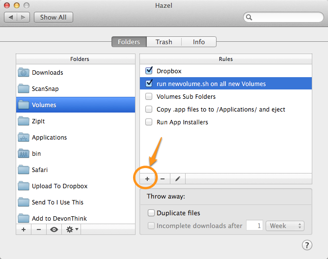
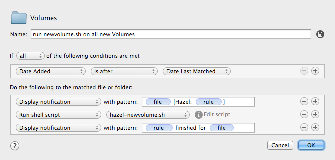
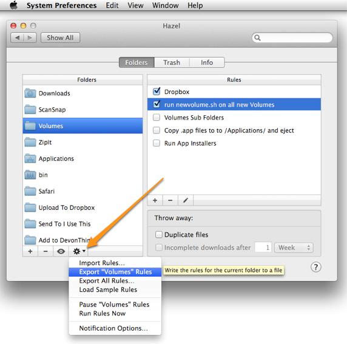

hazel-newvolume
===============

A shell script to work with Hazel to automatically install apps on OS X.

## The "Problem" ##

Many Mac apps come in ".dmg" files, and require the same set of steps:

1.	Mount the .dmg (which will then appear in **/Volumes/SomeNameHere/**)

2.	Find the .app inside the **/Volumes/SomeNameHere/**

3.	Copy the .app from **/Volumes/SomeNameHere/** to **/Applications/**

4.	Say "yes" when asked if you want to replace it

5.	Wait for the install to finish

6.	Eject the .dmg

## One Solution ##

Most of those steps can be automated, but there are some details which need to be considered:

1.	How can you tell if a new volume is a DMG?

2.	Assuming it is determined to be a DMG, how do you identify what needs to be installed? There are several possibilities, the first two is the most likely, but the others need to be considered:

	*	There is one .app which needs to be copied to /Applications/. *(This is the most common situation.)*

	*	it is a .pkg file which needs to be installed *(second most common)*

	*	There is one .app but it ***is*** an installer (iTunes, Default Folder X, etc)

	*	it is a prefPane which needs to be installed either to ~/Library/PreferencePanes/ or /Library/PreferencePanes/

	*	there may be an .app *and* a .pkg file (MakeMKV) 

	*	there may be more than one app in the .dmg (for example: MailMate's DMG also includes SpamSieve)

	*	there may be more than one app and more than one pkg

3.	Once we have determined what needs to be installed, there are more considerations to make:

	*	Is the app already installed?

		*	is it currently running?

		*	does it have any 'helper' apps that are running?

		*	if the app or any of its helper apps are running, can they be quit *safely* (or at least, relatively safely)?

	*	Is the version we are considering installing newer than the currently installed version? 

		*	if no, does that mean we should *stop* the installation or just inform the user, who might *want* to replace a newer, buggier version of an app with an older version? (Our answer may depend somewhat on what we do with apps that are already installed.)

4.	{Other?}

## Version 0.01 (2014-01-01) ##

To start with I decided to only deal with the most common scenario: a DMG is mounted and it has an app which is not an installer.

The script will be called via Hazel. Choose /Volumes/ as the Folder and then create a new rule using the "+" under “Rules”: 

This is the rule that I created:

"Dated Added" "is after" "Date Last Matched" means that it will run _once_ for every new item added to /Volumes/ (so the script will need to be smart enough to tell when it is not being used on a dmg).

The two Display Notifications are mostly for debugging purposes, so I can tell when the recipe has started and finished.

### Faux Hazel Syncing

***Hazel*** doesn't sync its rules across Macs, *but* you can sort of fake it when you are creating a rule which points to a shell script on Dropbox.

*	**Create the rule on one Mac, including the "Run Shell Script" part. Instead of using an embedded script, use an external script file which is saved on Dropbox.**  The full path to **`hazel-newvolume.sh`** is **`/Users/luomat/Dropbox/bin/hazel-newvolume.sh`** on all of my Macs which sync via Dropbox. You can put it wherever you want in *your* Dropbox, as long as the paths are the same on all of your Macs. (*Note:* on one computer which does not have enough internal storage for my Dropbox, I told the Dropbox.app to put its folder on **`/Volumes/External/Dropbox`** but then I *linked* it to **`/Users/luomat/Dropbox/`** .)

*	**Click the gear icon in Hazel and Export "Volumes" rules from Hazel.** (see image) I'd suggest putting the **`Volumes.hazelrules`** file in Dropbox to make it easier to import on your other Macs.

* **On the other Macs, make sure you have an entry for /Volumes/ under Folders.** You can then import the **`Volumes.hazelrules`** file by either: a) using the same 'gear' menu in the above image (choose "Import Rules…"), or b) drag the **`Volumes.hazelrules`** file to the /Volumes/ item under "Folders" or c) simply double-click the **`Volumes.hazelrules`** file and choose to import it into Volumes:

Once I have exported this Hazel rule on one Mac and imported it on the other Mac(s), any changes I make to the **`hazel-newvolume.sh`** script will be reflected on all of the computers which sync via Dropbox.